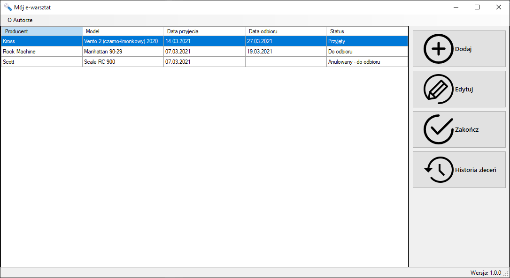
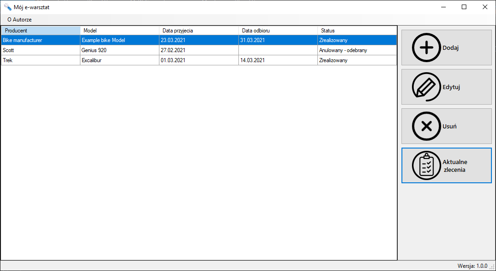
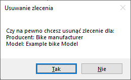
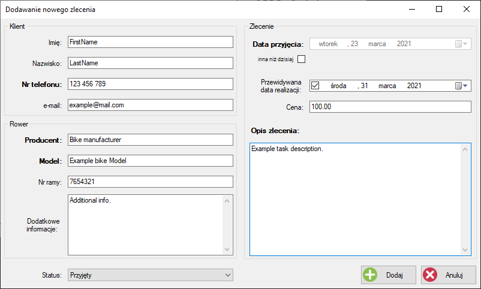
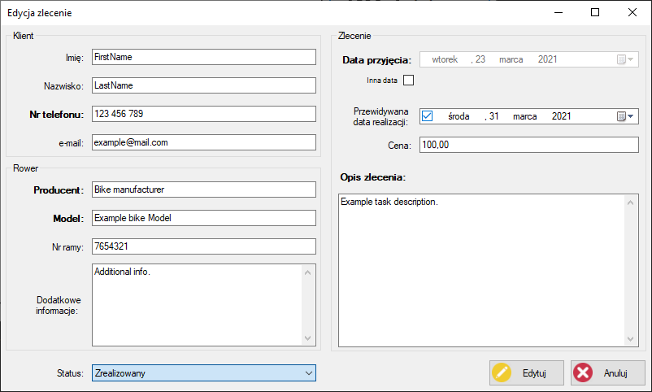
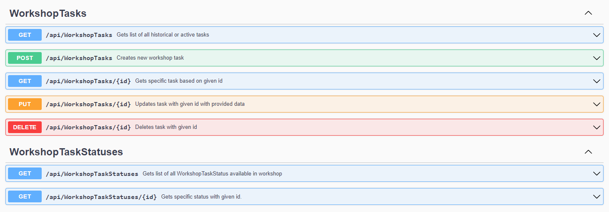

## Bicycle workshop application
Simple application for managing orders in a bicycle workshop. 
 
 

### Application consist of:

### Main window in two configurations:
#### Listing active tasks
 

#### Listing finished tasks
 

 
In those windows, the user can see basic information of active and finished tasks. On the side are located navigation buttons. 

  **With them user can:**
- Add new task
- Manage selected task
  - in active tasks configuration - finishing tasks
  - in history configuration - deleting tasks
- Finish selected task
- Switch between viewing historical and active tasks

#### While deleting task from history user will be prompted to confirm his action
 
 
 
 

### Adding task window:
 
 
 #### Mandatory fields:
 - Phone number
 - Bicycle manufacturer
 - Bicycle model
 - Date of admission
 - Task description
 
 #### Optional fields:
 - First name of customer
 - Last name of customer
 - e-mail of customer
 - Bicycle frame number
 - Additional informations about bicycle
 - Estimated date of task completion
 - Estimated cost of task
 
 By default date of admission and estimated date of  task completion are locked. To unlock them user has to check checkboxes under label (admission) or inside field (completion).
 If the user does not enable date fields their values will be:
  - Current day for admission date
  - Empty for date of completion

User also has possibility to chose the starting state of the task.
 
 
 

### Editing task window:
 
   
This window is mostly the same as adding task window but allow user to edit selected task.
 
 
 

## Bicycle workshop API
Project has been extended with API for managing tasks in workshop. Documentation available in Swagger UI after starting the project.
### Swagger UI of API:
 

## Configuration
Application requires database connection to work properly. Application will automaticaly create database and seed it with default tasks statuses.
 
 
Application requires connection string in `App.config` to work properly
 
<pre lang="xml">
&ltconnectionStrings&gt
    &ltadd name="WorkshopDB" connectionString="YOUR CONNECTION STRING" providerName="System.Data.SqlClient"/&gt
&lt/connectionStrings&gt
</pre>
 

By default:
 
<pre lang="xml">
&ltconnectionStrings&gt
    &ltadd name="WorkshopDB" connectionString="Data Source=.;Initial Catalog=WorkshopDB;Integrated Security=True;" providerName="System.Data.SqlClient" /&gt
&lt/connectionStrings&gt
</pre>
